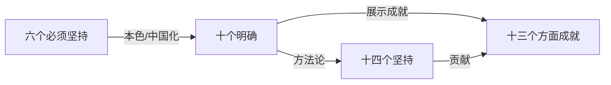

> [!NOTE]
> 康奈尔笔记

### 线索
#### 开篇
1. Teacher：[[何君]]
2. 课前分享：
	1. **为什么中国特色社会主义是历史和人民的选择？**
		1. 分享
			1. 是历史的选择
				1. 历史任务（决定了实行什么主义）
					1. 实现满足独立、人民解放和国家富强、人民幸福
				2. 历史过程
					1. 地主阶级改良：洋务运动
					2. 资产阶级：维新运动
					3. 资产阶级：辛亥革命
					4. ... ...
					5. 民国：资本主义（最大的问题：资源集中在四大家族中）
					6. 共产党：共产主义（首次以人民为基础）
				3. 历史成就
					1. 略
			2. 是人民的选择
				1. 人民地位：人民是历史的创造者
				2. 得民心者得天下：有益于人民而且可行（即为人民谋福利），因此是人民的选择
				3. 人民主动参与了革命和主义的形成
			3. 结论
				1. 是历史和人民的共同选择
		2. 思考
			1. 只从人民地位无法推出 “是人民的选择”
				1. 应当是因为其：
					1. 源于人民：马克思主义的人民性
					2. 为了人民
					3. 代表人民
					4. 依靠人民
	2. **为什么中国特色社会主义是社会主义而不是其他的什么主义？**
		1. 分享
			1. 什么是科学社会主义
				1. 源自：马克思、恩格斯
				2. 意义：结合现实，
			2. 实践证明了中国特色社会主义适合中国
			3. 中国特色社会主义为什么是社会主义
				1. 表现
					1. 坚持中共领导
					2. 实行人民民主专政和人民代表大会
					3. 公有制为主体
					4. 以人民为中心
					5. 意识形态上，坚持马克思主义指导地位不变，践行社会主义核心价值观
		2. 思考
			1. 没有科学社会主义和中国特色社会主义的对比
				1. 科学社会主义基本原则
					1. 无产阶级政党是无产阶级先锋队（其领导）
					2. 建立无产阶级专政的国家
					3. 在生产资料公有制基础上组织生产
					4. 实行按劳分配
					5. 最终目标：消灭阶级、消灭剥削、实现人的全面而自由发展
	3. **我们如何坚定四个自信？**
		1. 分享
			1. 
		2. 思考
			1. 
#### 提示
1. 
#### 资源
- [与妻书（改良派作品）]()
- [檀香行（莫言作品）]()
- [剑桥民国史]()
#### 思考
1. 习近平思想包含什么内容：
	1. [[十个明确]]
	2. [[十四个坚持]]
	3. [[十三个方面成就]]
	4. [[六个必须坚持]]

### 笔记
#### 讲义、学习内容：新时代坚持和发展中国特色社会主义
1. 历史
	1. 见：开篇
2. 如何看待改革开放前后关系
	1. 互相联系
		1. 都是党领导人民进行社会主义建设的实践探索
		2. ~前为改革开放积累了工业体系等的基础 (反例：墨西哥)
	2. 最大区别
		1. 略
	3. 备注
		1. 千万不要有[[本本主义]]！
#### 课后提问 #疑问 
- “粉红”“反贼”世界观不一样？怎么和在异世界一样的
	- 看现实里面怎么做，网络是有滤镜的
- “根正苗红”重要吗/什么是“根正苗红”的主义？
- 国家社会主义和社会主义有什么区别，有什么联系？
	- 是否为某一小群体服务
- 当今国内的本本主义是不是文革的遗毒？
### 总结

